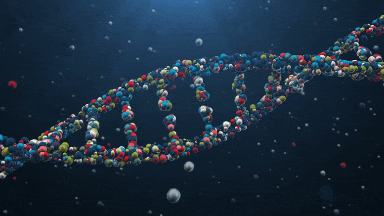

<!--  -->

 

<!--  

Contents

<ul class="toc_list">
  <li><a href="#First_Point_Header">1 First Point Header</a>
  <ul>
    <li><a href="#First_Sub_Point_1">1.1 First Sub Point 1</a></li>
    <li><a href="#First_Sub_Point_2">1.2 First Sub Point 2</a></li>
  </ul>
</li>
<li><a href="#Second_Point_Header">2 Second Point Header</a></li>
<li><a href="#Third_Point_Header">3 Third Point Header</a></li>
</ul>

 -->

<h1 align="center">About me</h1>

Hi! I'm currently (10/11/2022) a post-graduate researcher at the University of Nottingham working on adaptive sampling with nanopore sequencing. I'm interested in all sorts of Bioinformatics, visualisations and fun side projects ( Some of which I even complete ). 

<h2 align="center">Current Projects</h2>

   🐱‍💻 I'm currently working on:
  
[minoTour](https://github.com/LooseLab/minotourapp) - real-time monitoring of nanopore sequencers

[Swordfish](https://github.com/LooseLab/swordfish) - An inter-communicator for [minoTour](https://github.com/LooseLab/minotourapp) and [readfish](https://github.com/LooseLab/readfish)
 
[Advent Of Code](https://github.com/Adoni5/AdventOfCode1) 🎅🎅 - Just gotta love it
    

   🔭 How to reach me:
  
 Follow me on twitter for utter silence @rorymatics ◦ 
 Follow me on mastadon adoni5@genomic.social ◦ 
 Open issues! ◦
 📧 rory.munro@nottingham.ac.uk
 

