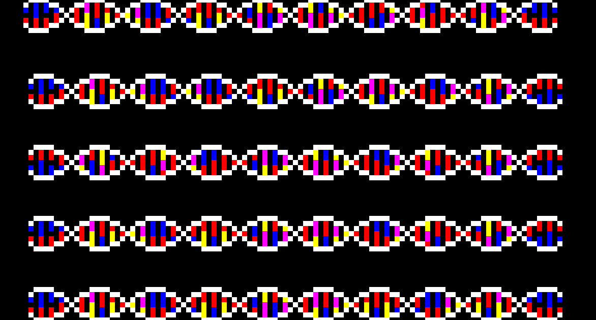

### About me
Hi! I'm currently (22/04/2022) a post-graduate researcher at the University of Nottingham working on adaptive sampling with nanopore sequencing. I'm interested in all sorts of Bioinformatics, visualisations and fun side projects ( Some of which I even complete ). 

  - 🐱‍💻 I'm currently working on:
    - [minoTour](https://github.com/LooseLab/minotourapp) - real-time monitoring of nanopore sequencers
    - [Swordfish](https://github.com/LooseLab/swordfish) - An inter-communicator for [minoTour](https://github.com/LooseLab/minotourapp) and [readfish](https://github.com/LooseLab/readfish)
    

  - 🔭 How to reach me:
    - Follow me on twitter for utter silence @rorymatics
    - Open issues! 
